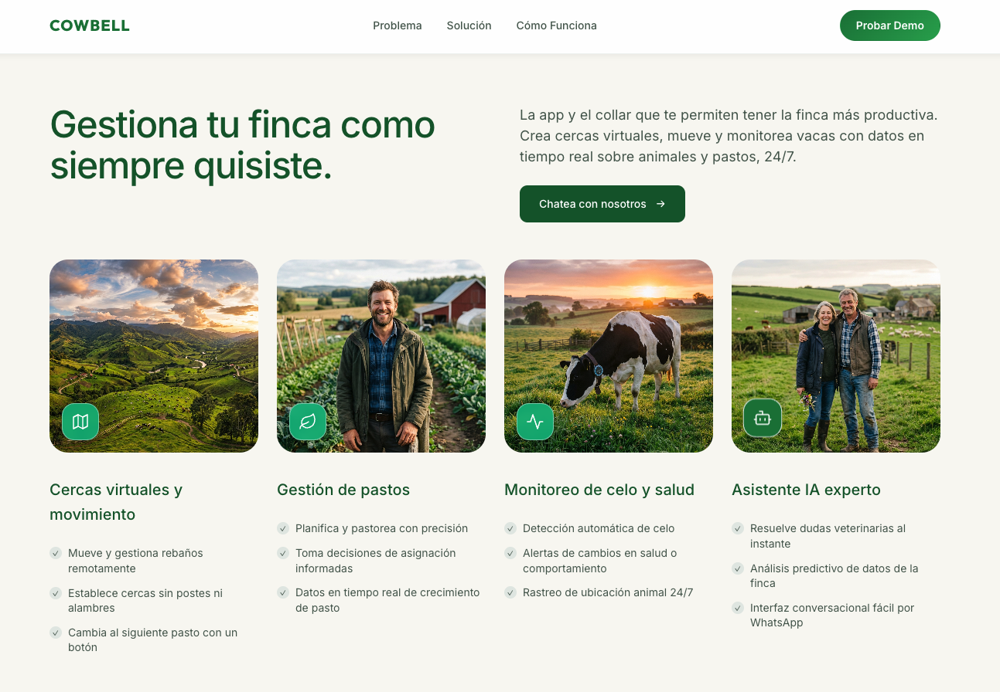
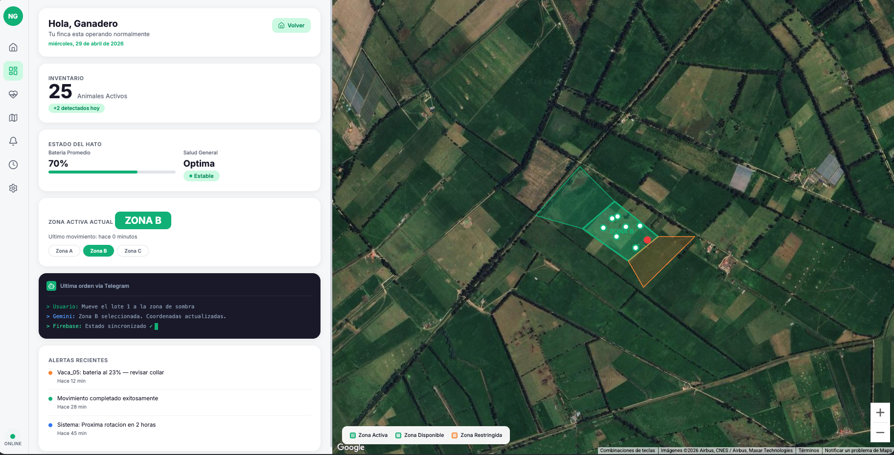
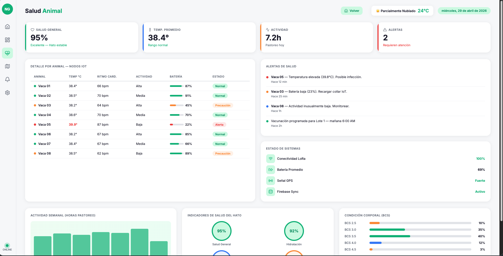
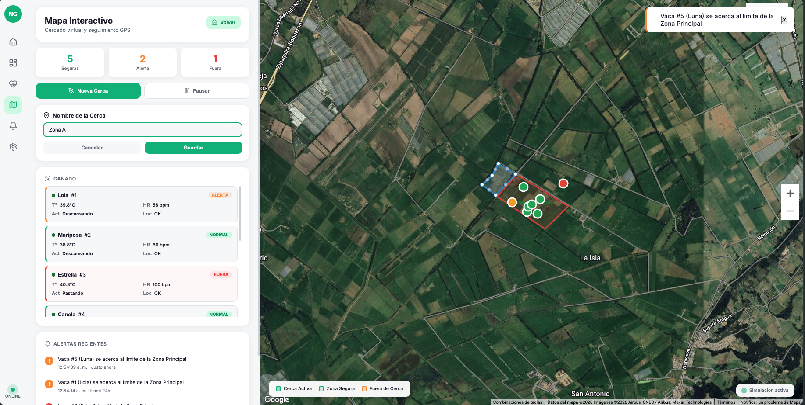

<div align="center">

# 🐄 CowBell — Nodo Ganadero

### Cercas Virtuales Inteligentes para la Ganadería Colombiana

[](https://hackathon.google.com/)

[](https://deepmind.google/technologies/gemini/)
[](https://firebase.google.com/)
[](https://developers.google.com/maps)

*Reemplazamos el alambre de púas con GPS, IoT e Inteligencia Artificial.*
*El ganadero habla, Gemini entiende, Firebase ejecuta.*

[Ver Demo](#-interfaces-del-proyecto) · [Wiki Completa](https://github.com/Wax-01/Hackaton-Google-CowBell/wiki) · [Ejecutar Localmente](#-cómo-ejecutar)


> ⚠️ **Atención:** las claves de las APIs están expuestas para facilitar la ejecución del proyecto. No deben usarse en producción.
</div>

---

## 🎯 El Problema

Colombia tiene **+29 millones** de cabezas de ganado distribuidas en **39 millones de hectáreas**. Sin embargo:

| Problema | Impacto |
|----------|---------|
| 🔴 Cercas físicas cuestan **~$3,000 USD/km** | Costos operativos insostenibles |
| 🔴 Productividad de **<1 animal/hectárea** | 3x por debajo del potencial |
| 🔴 Detección de enfermedades tarda **3-5 días** | Pérdidas por mortalidad evitable |
| 🔴 Principal causa de **deforestación** en Colombia | Presión ambiental y regulatoria |

> **CowBell resuelve estos 4 problemas con una solución 100% digital construida sobre el ecosistema de Google.**

---

## 💡 Nuestra Solución

```
  🎤 Ganadero                  🤖 Gemini                    🔥 Firebase
  envía audio                  interpreta                   ejecuta
  por Telegram                 y decide                     y sincroniza
       │                           │                             │
       ▼                           ▼                             ▼
  "Mueve las vacas        mover_ganado({                  cattle/lola →
   pa la zona norte"       nombre: "Lola",                fenceId: "zona-norte"
                            destino: "norte"})             status: "normal"
       │                           │                             │
       └───────────────────────────┼─────────────────────────────┘
                                   ▼
                          🗺️ Google Maps
                          actualiza la posición
                          de la cerca virtual
```

---

## 🛠️ Tecnologías de Google Utilizadas

### 🤖 Google Gemini 2.0 Flash — *IA como Infraestructura*

No usamos Gemini como chatbot. Lo usamos como **capa de infraestructura** que traduce lenguaje humano a acciones deterministas:

| Feature | Implementación | Archivo |
|---------|---------------|---------|
| **Function Calling** | 7 funciones declaradas que Gemini invoca automáticamente | [`bot/gemini.js`](./bot/gemini.js) |
| **Audio Processing** | Notas de voz → transcripción → intent → acción | [`bot/gemini.js`](./bot/gemini.js) |
| **System Instruction** | Persona "Centinela" adaptada al lenguaje rural colombiano | [`bot/gemini.js`](./bot/gemini.js) |
| **Multi-turn Chat** | Devuelve resultados de funciones a Gemini para respuesta natural | [`bot/handlers.js`](./bot/handlers.js) |

**Funciones declaradas en Gemini:**
```
consultar_ganado   → Estado de todo el hato o vaca específica
mover_ganado       → Mover una vaca a otra cerca/zona
crear_cerca        → Crear nueva cerca virtual
consultar_alertas  → Últimas alertas del sistema
consultar_cercas   → Listar zonas/potreros
registrar_vaca     → Agregar vaca al sistema
resumen_finca      → Resumen completo de la finca
```

### 🔥 Google Firebase (Firestore) — *Backend en Tiempo Real*

| Feature | Implementación | Archivo |
|---------|---------------|---------|
| **Firestore** | 3 colecciones: `cattle`, `fences`, `events` | [`bot/firebase.js`](./bot/firebase.js) |
| **Real-time Sync** | Dashboards escuchan cambios con `onSnapshot()` | [`src/js/firebase-config.js`](./src/js/firebase-config.js) |
| **Event Logging** | Cada acción del bot genera un event con timestamp | [`bot/firebase.js`](./bot/firebase.js) |
| **Server Admin** | `firebase-admin` para operaciones del bot (sin auth de usuario) | [`bot/firebase.js`](./bot/firebase.js) |

### 🗺️ Google Maps JavaScript API — *Visualización Geoespacial*

| Feature | Implementación | Archivo |
|---------|---------------|---------|
| **Satellite View** | Vista satelital de la finca | [`src/js/map.js`](./src/js/map.js) |
| **Polygons** | Cercas virtuales como polígonos coloreados | [`dashboard.html`](./dashboard.html) |
| **Markers** | Posición GPS de cada vaca (animación suave) | [`src/js/map.js`](./src/js/map.js) |
| **Drawing Manager** | Dibujar nuevas cercas interactivamente | [`src/js/fences.js`](./src/js/fences.js) |
| **InfoWindows** | Datos de salud/batería al clic en cada nodo | [`dashboard.html`](./dashboard.html) |

---

## 📸 Interfaces del Proyecto

### 1. Landing Page — Presentación Comercial

Página de aterrizaje con estética SaaS premium. Incluye hero con KPIs, sección de problemas, solución de IA, "Cómo funciona" en 3 pasos, grid de features y testimonios.



---

### 2. Dashboard de Monitoreo — El Mapa en Tiempo Real

Centro de control con **Google Maps satelital**. Muestra zonas de pastoreo (polígonos), posición de cada vaca (marcadores GPS), terminal del bot Telegram y alertas.



**Componentes visibles:**
- 🗺️ **Mapa satelital** con 3 zonas virtuales (activa, disponible, restringida)
- 📍 **8 nodos GPS** representando vacas individuales con movimiento animado
- 🤖 **Terminal** mostrando flujo: `Usuario → Gemini → Firebase ✓`
- 📊 **Métricas**: inventario, batería promedio, zona activa

---

### 3. Dashboard de Salud Animal — Telemetría IoT

Módulo dedicado a la **analítica predictiva**. Monitoreo de temperatura, frecuencia cardíaca, actividad y batería de cada collar IoT.



**Componentes visibles:**
- 🌡️ **KPIs**: Salud general 95%, Temp promedio 38.4°C, Actividad 7.2h
- 📋 **Tabla de nodos IoT**: datos individuales de cada vaca
- ⚠️ **Alertas de salud**: detección de fiebre, batería baja
- 📈 **Gráficos**: actividad semanal, gauges de salud, distribución BCS

---

### 4. App Interactiva — Dibujar Cercas Virtuales

Interfaz donde el ganadero puede **dibujar cercas virtuales** directamente sobre el mapa, asignar vacas y controlar la simulación.



---

## 📚 Wiki Completa

Hemos documentado extensamente el contexto, la oportunidad y la tecnología:

| # | Sección | Contenido |
|---|---------|-----------|
| 🟢 | [Contexto Colombia](./Wiki/1-Contexto-Ganaderia-Colombia.md) | PIB, empleo, inventario bovino, zonas productoras, puntos de dolor |
| 🔵 | [Oportunidad AgTech](./Wiki/2-Oportunidad-Mercado-AgTech.md) | Océano azul, brecha de eficiencia, TAM estimado |
| 🟠 | [Desglose Técnico](./Wiki/3-Desglose-del-Proyecto.md) | 5 pilares: GPS, IA, IoT, UX, Sostenibilidad |
| 🔴 | [Arquitectura & Google APIs](./Wiki/4-Arquitectura-APIs-Google.md) | Diagrama de capas, modelo de datos, estructura de archivos |
| 🟣 | [Guía de Interfaces](./Wiki/5-Guia-Interfaces-UI.md) | Componentes de cada pantalla, principios de diseño |

---

## 🚀 Cómo Ejecutar

### Requisitos
- **Node.js** v18+
- Claves de API: Google Gemini, Firebase, Maps
- Token de Telegram Bot ([@BotFather](https://t.me/BotFather))

### 1. Frontend (Landing + Dashboards)
```bash
# Clonar e instalar
git clone https://github.com/your-repo/Hackaton-Google-CowBell.git
cd Hackaton-Google-CowBell
npm install

# Ejecutar servidor de desarrollo
npm run dev
# → Abre http://localhost:3000
```

### 2. Backend (Bot de IA con Gemini)


```bash
cd bot
npm install

# Configurar variables de entorno
cp .env.example .env
# Editar .env con tus credenciales:
#   TELEGRAM_BOT_TOKEN=tu_token
#   GEMINI_API_KEY=tu_api_key
#   FIREBASE_PROJECT_ID=tu_project_id

# Iniciar el bot
npm start
# → El bot escucha en Telegram como @CentinelaAgro_bot
```

### Páginas Disponibles

| Ruta | Descripción |
|------|-------------|
| `/` | Landing page comercial |
| `/dashboard.html` | Dashboard de monitoreo con Google Maps |
| `/app.html` | App interactiva (dibujar cercas) |
| `/salud.html` | Dashboard de salud animal (telemetría IoT) |

---

## 🏗️ Arquitectura

```
┌─────────────────────────────────────────────────┐
│            FRONTEND (Vite + Vanilla JS)         │
│   Landing · Dashboard Mapa · Dashboard Salud    │
│              Google Maps API                    │
├─────────────────────────────────────────────────┤
│           INTELIGENCIA (Gemini 2.0 Flash)       │
│   NLP · Function Calling · Audio Processing     │
├─────────────────────────────────────────────────┤
│           COMUNICACIÓN (Telegram Bot API)       │
│   Texto · Voz · Comandos → Intent → Acción      │
├─────────────────────────────────────────────────┤
│             DATOS (Firebase Firestore)          │
│   cattle · fences · events · Real-time Sync     │
└─────────────────────────────────────────────────┘
```

---

<div align="center">

### 🇨🇴 Construido con pasión para la Hackathon de Google 2026

*Transformando la ganadería colombiana con Inteligencia Artificial*

**Google Gemini** · **Firebase** · **Google Maps** · **Telegram**

---

*CowBell® y Sistema de Cercas Virtuales™ — Hackathon Google 2026*

</div>
